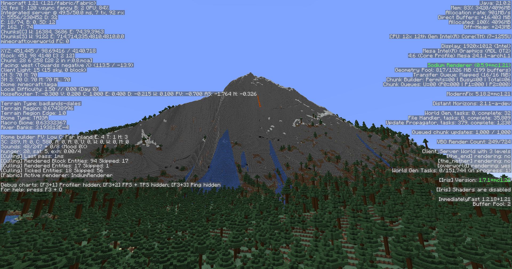

# arc's fork of ReTerraForged for 1.21 Fabric

**do not report bugs with this fork to the original authors**

**arc will not provide support for this fork**

This is based on <https://github.com/racoonman2/ReTerraForged/commit/b8f336742770eb29c2233d4d1fe2607a524857fb>,
the last commit where RTF v0.0.6 presets still seem to generate reasonable terrain. Note that this fork is
(probably) not compatible with worlds generated with RTF v0.0.6 and builds terrain differently than v0.0.6.
